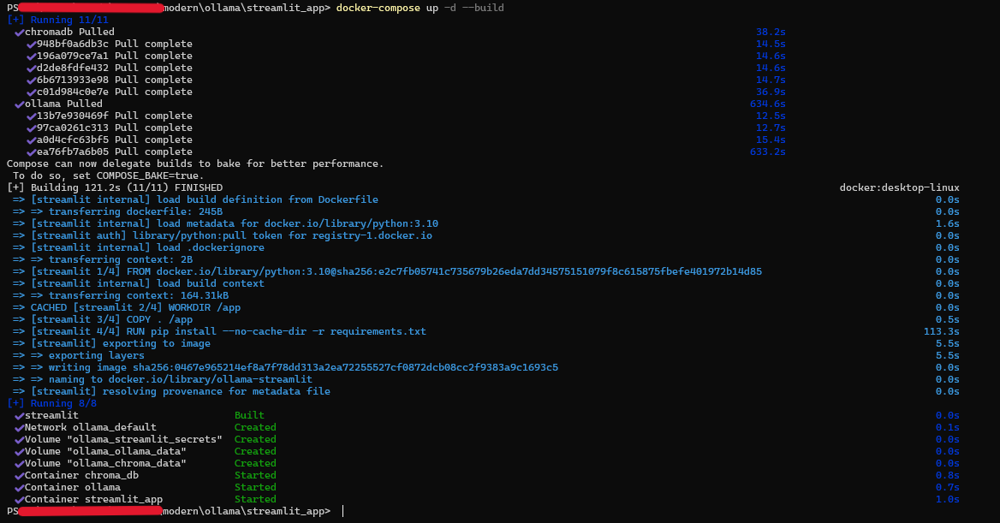

### Step 1) Download the "Ollama" repository on our GitHub

[GitHub Repo](https://github.com/UHMCyberAnalytics/modern)

### Step 2) Make sure you have Docker is installed and running

[Docker Install Link](https://www.docker.com/)


### Step 3) Open Terminal and Build Docker Container

##### Locate the GitHub repo you just downloaded in terminal and make you way towards the streamlit_app folder


locate the streamlit_app folder then follow these commands
```
cd streamlit_app
docker-compose up -d --build
```
It should look like this after running the commands


### Step 4) Open New Build Container


Click open container and it should look like this. Then open the local host link


### Step 5) Input Keys and Model

After Inputting the model and keys you are now able to use the program


### Closing the Program

To close the Docker program just type the following in your terminal
```
docker-compose down
```


